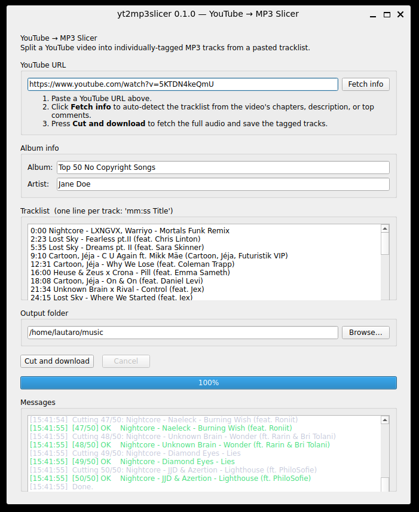

# yt2mp3slicer

Cross-platform desktop app that downloads a YouTube video — typically a
full-album upload, DJ mix, or OST compilation — and splits its audio into
individually-tagged MP3 tracks based on a `mm:ss Title` tracklist. Runs on
**Windows**, **macOS**, and **Linux**.

> **Just want one song as MP3?** Use any free online "YouTube to MP3"
> converter. yt2mp3slicer is for *slicing* one long video into many tagged
> tracks.

- Downloads via `yt-dlp` and cuts losslessly (`ffmpeg -c copy`).
- **Auto-detects** the tracklist from chapters, description, or top comments.
- Writes ID3v2 tags (title, artist, album, track number).



## Install

Grab the latest build for your platform from **Releases**. `ffmpeg` and
`ffprobe` are bundled — nothing else to install.

| Platform            | File                                | First-launch notes                                                              |
|---------------------|-------------------------------------|---------------------------------------------------------------------------------|
| Windows             | `yt2mp3slicer-windows.zip`          | Unzip and double-click `yt2mp3slicer.exe`.                                      |
| macOS Apple Silicon | `yt2mp3slicer-macos-arm64.zip`      | Unzip the `.app`. Unsigned, so right-click -> *Open* the first time. macOS 11+. |
| macOS Intel         | `yt2mp3slicer-macos-x86_64.zip`     | Unzip the `.app`. Unsigned, so right-click -> *Open* the first time. macOS 11+. |
| Linux               | `yt2mp3slicer-linux-x86_64.tar.gz`  | Untar and run `./yt2mp3slicer`.                                                 |

## Use

1. Paste a YouTube URL.
2. Click *Fetch info* to auto-fill album, artist, and tracklist.
3. Edit fields if needed.
4. Pick an output folder.
5. Click **Cut and download**.

### Tracklist format

One line per track: `mm:ss Title`. `H:MM:SS` works for 1+ hour videos.
Leading track numbers (`1.`, `01)`, `1 -`) and ` - ` separators are tolerated.

```
0:00 Intro
3:01 Sunrise
1:23:45 A Long Bonus Track
```

Each track ends where the next begins; the last ends at the end of the file.

### Output

The app creates a subfolder named after the album (e.g. `Echoes of Tomorrow/`)
and writes `01 - Intro.mp3`, `02 - Sunrise.mp3`, … each tagged with `title`,
`artist`, `album`, `albumartist`, and `tracknumber: N/Total`.

### Audio quality

Tracks are encoded at **192 kbps CBR MP3**, and the bitrate isn't configurable
on purpose. YouTube's best audio stream is itself lossy (Opus or AAC, typically
~128–160 kbps), so re-encoding to 256 or 320 kbps wouldn't recover any
information the source already discarded — it would only grow the file size.
192 kbps comfortably preserves what's actually there.

## Develop

Setup is managed by [**uv**](https://docs.astral.sh/uv/). You also need
`ffmpeg` on `PATH` for local runs (`brew install ffmpeg`,
`sudo apt install ffmpeg`, or `winget install Gyan.FFmpeg`); release bundles
ship their own copy.

```bash
git clone <repo> yt2mp3slicer
cd yt2mp3slicer
uv sync
pre-commit install

```

Day-to-day:

```bash
make             # list targets
make run         # launch the app
make test        # run pytest
make build       # build a self-contained bundle for the current OS
```

`uv run` (and the `make` targets) refresh `.venv` from `uv.lock` on demand,
so there's no virtualenv to activate. Add a dependency with
`uv add <pkg>` (or `uv add --group dev <pkg>` for tooling); commit
`pyproject.toml` and `uv.lock` together.


## License

MIT — see [LICENSE](LICENSE).
